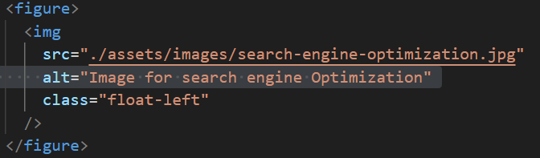

# HTML, CSS, and Git: Code Refactor

# # Motivation

To refractor the starter code that follows accessibility standards, so that the website is optimized for search engines

## Meeting Acceptance Criteria

### Acceptence Criteria 1 : Source code with Semantic HTML elements

The acceptence criteria is met by replacing div elements in the code with appropriate html elements as shown in the picture below.
()

### Acceptence Criteria 2 : Html elements follow a logical structure independent of styling and positioning

The acceptence criteria is met by using appropriate html elements as it is displyed on the web page
Example : usage of elements like nav, article etc as per standard.

### Acceptence Criteria 3 : Icon and Image elements should have accessible alt attributes

The acceptence criteria is met by including alt attribute with relavant value in the  element as shown in the picture below.

### Acceptence Criteria 4 : Heading attributes fall in sequential order

The acceptence criteria is met by updating the h2 element in footer section to h4 so that the header attributes shall fall in sequential order.

### Acceptence Criteria 5 : Web page should have concise, descriptive title

The acceptence criteria is met by assigning a descriptive value to the title element as shown in the screen shot below.

## Deployed Application can be accessed using the url : https://sangeethagnanavel.github.io/Module-1-Challenge/
